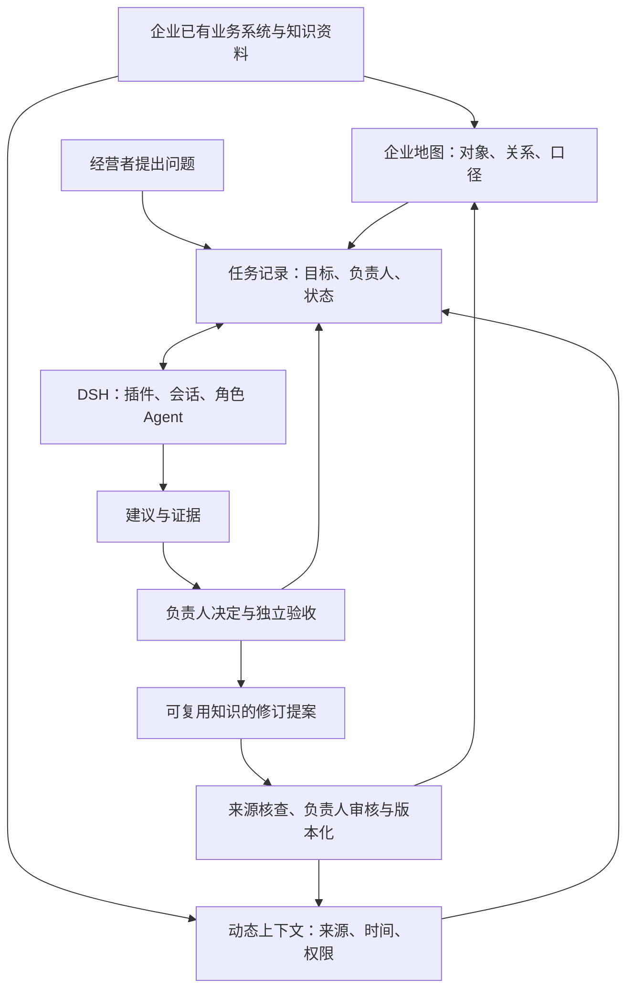

# 跨行业任务 ERP（产品设计稿）

## 要解决的经营问题

本项目关注跨越资料、指标、系统与负责人的经营任务。这里把“任务 ERP”用作一个**产品方向名称**：围绕一条经营任务组织业务对象、当前事实、Agent 协作、负责人决定与验收回执。它不是传统 ERP 的订单、库存、会计或人事主账，也不替企业接管这些系统。

本仓库目前只有文档；下述任务记录、业务地图、动态上下文和角色 Agent **均为拟开发能力**。服装经营场景只是设计输入之一，不能证明跨行业能力已经实现。

项目围绕两个问题展开：

1. **怎样由经营者主持一套与 AI 协作的任务系统？**经营者设定目标、授权边界、责任人与验收标准；DSH 组合 Agent、工具和会话；本项目设计跨会话任务记录、工作台与受限接入。经营者在隔离环境中试运作，再根据可回读证据决定是否扩大范围。
2. **怎样让经营和系统建设相互促进？**每项任务既服务当下的经营判断，也产生有来源的证据、人的决定、执行回执和未解决问题。只有核查过的部分才能进入可复用 Context 或业务本体；下一次任务引用这些版本并继续验证。

以下是目标结构示意，不代表这些连接已运行：

## 一套内核，按企业配置

| 层 | 跨行业公共契约 | 企业或行业自行配置 |
|---|---|---|
| 任务 | 目标、状态、负责人、证据、下一步和验收回执 | 决策规则、审批链、任务模板 |
| 企业地图 | 对象类型、关系、指标口径、来源与版本 | 商品、项目、合同、设备等对象和字段 |
| 动态上下文 | 按任务选择资料，保留来源、时间范围、刷新状态和权限 | 数据源、知识库、更新频率与可见范围 |
| 角色 Agent | 在同一任务上按职责读取和提出建议 | 老板、财务、销售或企业自定义角色的目标与权限 |
| DSH 执行层 | 通过 Profile 组合适配的插件和 Agent 能力 | 安装选择、模型、工具和本地运行配置 |
| 企业系统 | 维持事实、授权与业务动作的原有系统 | 企业自己的 ERP、CRM、财务、人事及其他系统 |

“老板 Agent / 财务 Agent / 销售 Agent”是**角色视角的示例**，不是每家企业必须安装的三个 Agent，也不代表它们能自行批准财务、人事或客户动作。企业地图的对象关系用于解释任务；动态上下文提供某一时点可核查的资料，两者都要保留来源和版本。

## 最小任务契约

一条可追踪任务至少需要以下字段；具体存储形式和 DSH 接口仍待验证。

| 字段 | 用途 |
|---|---|
| `task_id`、`project_id` | 将任务与项目关联，使任务寿命独立于单次会话 |
| `question`、`success_criteria` | 记录要解决的问题与可验收结果 |
| `owner`、`reviewer` | 指明推进人与独立验收人；权限由企业系统另行核对 |
| `scope` | 限定企业、时间范围、业务对象和可用数据 |
| `status`、`next_action` | 保存当前状态与下一步，供中断后恢复 |
| `source_refs` | 记录资料或指标来源、口径、版本、获取时间和刷新状态 |
| `evidence_refs`、`unknowns` | 关联可回读证据，并显式保留缺失或冲突事实 |
| `proposal`、`decision`、`receipt` | 分开保存 Agent 建议、负责人决定和外部执行回执 |

建议的最小状态流是“待定义 → 进行中 → 待验收 → 已验收／退回／取消”。涉及外部写入时，应另有“已授权 → 已执行待回读 → 已核实”的动作记录；**Agent 说已完成，不等于源系统已执行，也不等于负责人已验收**。任务状态需跨会话持久化，恢复时从最近一个独立核实的节点继续；存储与事件接口的具体方案尚未定。

## 从任务证据到 Context 与企业本体

这里区分四种资产，避免把聊天记录或新增数据直接当成企业知识：

| 资产 | 保存什么 | 进入下一次任务前的检查 |
|---|---|---|
| 源系统数据 | 订单、项目、合同、账务等原始记录 | 仍以企业系统为事实来源；核对身份、时间范围、口径与读取权限 |
| 任务记录 | 目标、过程事件、证据引用、人的决定、回执与未知项 | 能按 `task_id` 回读；区分草稿、已核实和已验收 |
| 动态 Context | 为当前任务挑选的事实快照、规则和相关历史 | 标注来源、版本、获取时间、有效范围和授权；过期或冲突需显式呈现 |
| 企业业务本体 | 稳定的对象、关系、事件、指标定义及责任归属 | 变更以提案、审核、生效版本和回滚记录管理；不由 Agent 默默改写 |

建议的积累过程是：**经营任务 → 证据与结果回读 → 可复用知识提案 → 负责人核查和版本化 → 下一任务按需引用 → 再核对实际结果**。失败、退回和“目前不知道”也应保留为任务证据，不自动变成通用规则。只有在来源可靠、定义明确、权限允许且后续任务确实用得上时，沉淀才可能带来复用价值；本项目尚未验证经营收益或决策质量提升。

业务本体描述“这家企业有什么对象、它们如何关联、指标怎样定义”；动态 Context 回答“这项任务在这一时间点可使用哪些可信资料”。两者相互关联，但更新频率和审核责任不同。系统应能指出一次建议引用的是哪个本体版本、哪份 Context 快照和哪条源系统证据。

## 两个合成场景验证跨行业性

| 同一任务步骤 | 零售样例 | 服务企业样例 |
|---|---|---|
| 定义异常 | 商品销量下降且库存偏高 | 项目进度延期且应收款临近到期 |
| 企业地图 | 商品、仓库、订单、渠道 | 项目、合同、里程碑、客户 |
| 动态上下文 | 锁定日期范围的销量与库存视图 | 锁定日期范围的进度与应收视图 |
| Agent 草稿 | 原因假设与补货／促销待决项 | 阻塞项与交付／回款待决项 |
| 人的验收 | 经营负责人核对口径并决定动作 | 项目与财务责任人核对事实并决定动作 |

这两列都是**合成用例**，不对应任何真实企业或客户。验收重点是同一任务契约可容纳两种对象与指标，公共层里没有写死“商品”“库存”等行业字段。财务与客户数据只有在后续明确授权和隔离验证后才可能接入真实系统。

## 插件与系统边界

- DSH 提供 Agent 运行和插件组合；本项目计划提供任务视图、任务契约适配、受限资料接入与证据呈现。不能仅凭 UI 列表声称已经有任务 ERP。
- 持久任务记录需要有可回读的存储与事件接口，**不以聊天记录代替任务账本**。采用 DSH 原生能力还是外部服务，须先核对版本、权限、恢复和停用路径。
- 业务系统仍是订单、账务、员工等事实与写入权限的来源；数据仓库或知识库由企业持有。插件只读取任务需要的最小资料。
- 外部动作先形成可审阅建议，再由有权限的人批准；执行后以目标系统回执验证，失败与未知状态不能自动写成成功。
- 公开仓库只放通用契约、插件源码和合成示例，不收录任何企业 Profile、凭据、内部业务规则或真实经营数据。

## 第一个可验收切片

先在隔离的 DSH Profile 中，用两个行业的合成资料完成同一类“经营异常核查”任务：建任务、读取有来源的数据、保留缺口、形成建议、跨会话继续、由人验收。再用一次后续合成任务验证：它能引用**已审核**的 Context 和本体版本，同时排除未审核、过期或越权的材料。检查停用相关插件后 DSH 原生会话与用户数据能保留。这个切片通过前，项目只标记为设计或原型；真实企业部署、自动审批和外部写入另设验收门槛。

实施顺序见[插件路线图](PLUGIN-ROADMAP.md)，运行与权限边界见[架构边界](ARCHITECTURE.md)。DSH 官方目前标为开发者预览版，安全和兼容边界以[官方说明](https://github.com/deepseek-ai/deepseek-harness/blob/master/SAFETY.md)为准。
